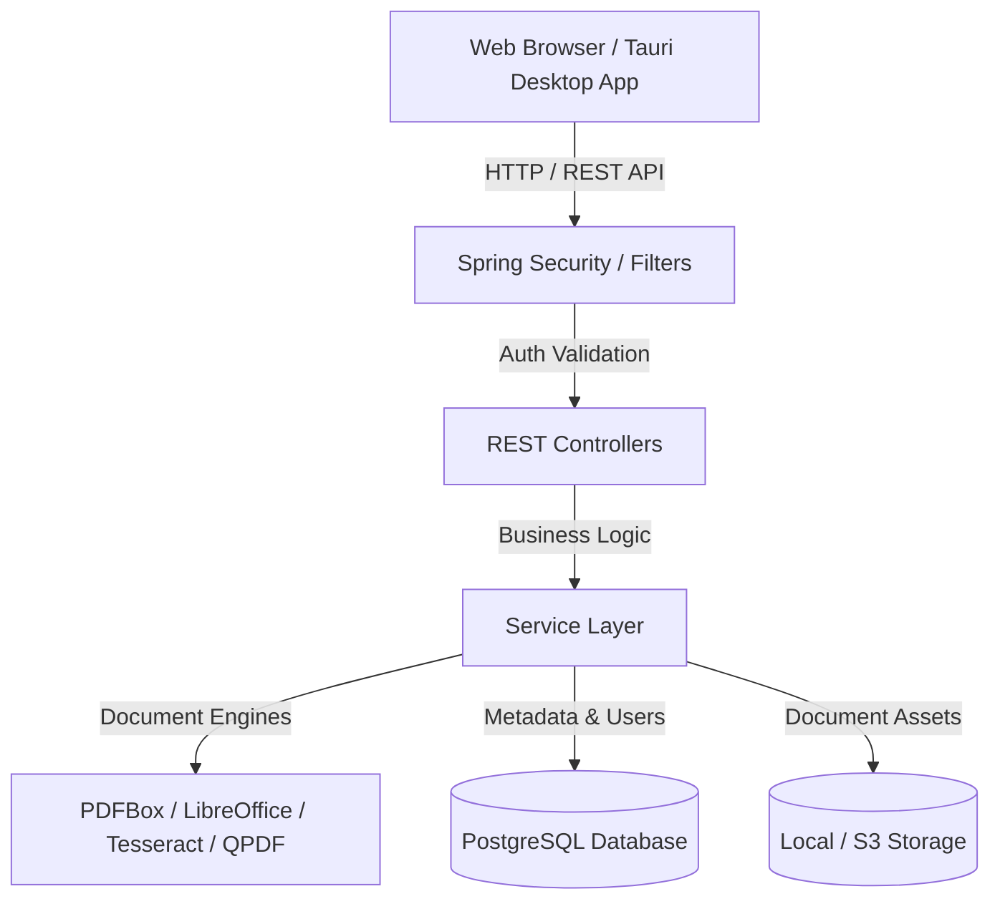
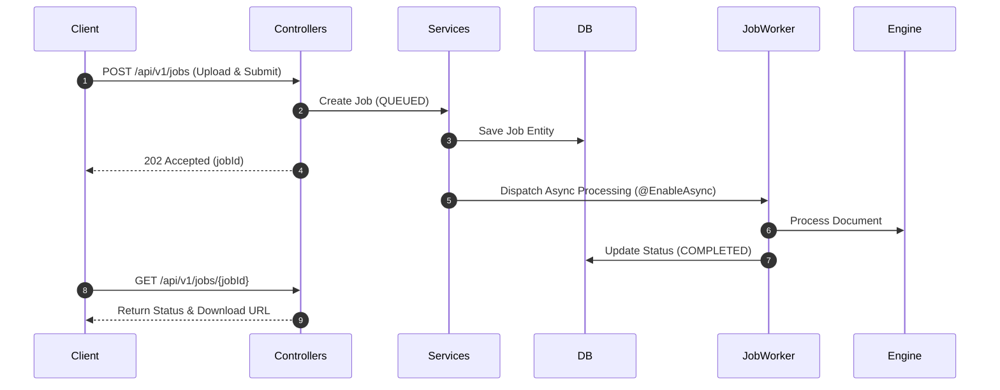

# PaperForge Architecture & Design

High-level architecture, component interaction, and data flow design.

---

## 📐 System Architecture Diagram

```mermaid
graph TD
    Client[Web Browser / Tauri Desktop App] -->|HTTP / REST API| Proxy[Spring Security / Filters]
    Proxy -->|Auth Validation| Controllers[REST Controllers]
    Controllers -->|Business Logic| Services[Service Layer]
    Services -->|Document Engines| Engine[PDFBox / LibreOffice / Tesseract / QPDF]
    Services -->|Metadata & Users| DB[(PostgreSQL Database)]
    Services -->|Document Assets| Storage[(Local / S3 Storage)]
```

## 🔄 Async Job Processing Sequence Diagram

```mermaid
sequenceDiagram
    autonumber
    Client->>Controllers: POST /api/v1/jobs (Upload & Submit)
    Controllers->>Services: Create Job (QUEUED)
    Services->>DB: Save Job Entity
    Controllers-->>Client: 202 Accepted (jobId)
    Services->>JobWorker: Dispatch Async Processing (@EnableAsync)
    JobWorker->>Engine: Process Document
    JobWorker->>DB: Update Status (COMPLETED)
    Client->>Controllers: GET /api/v1/jobs/{jobId}
    Controllers-->>Client: Return Status & Download URL
```
